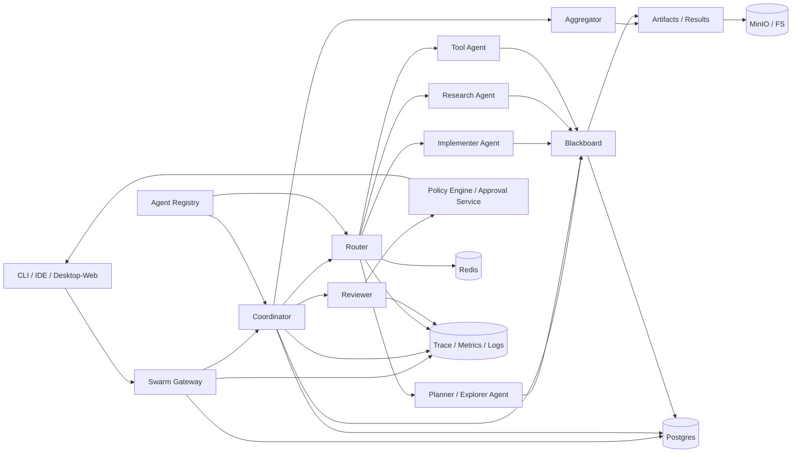
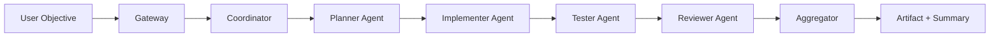
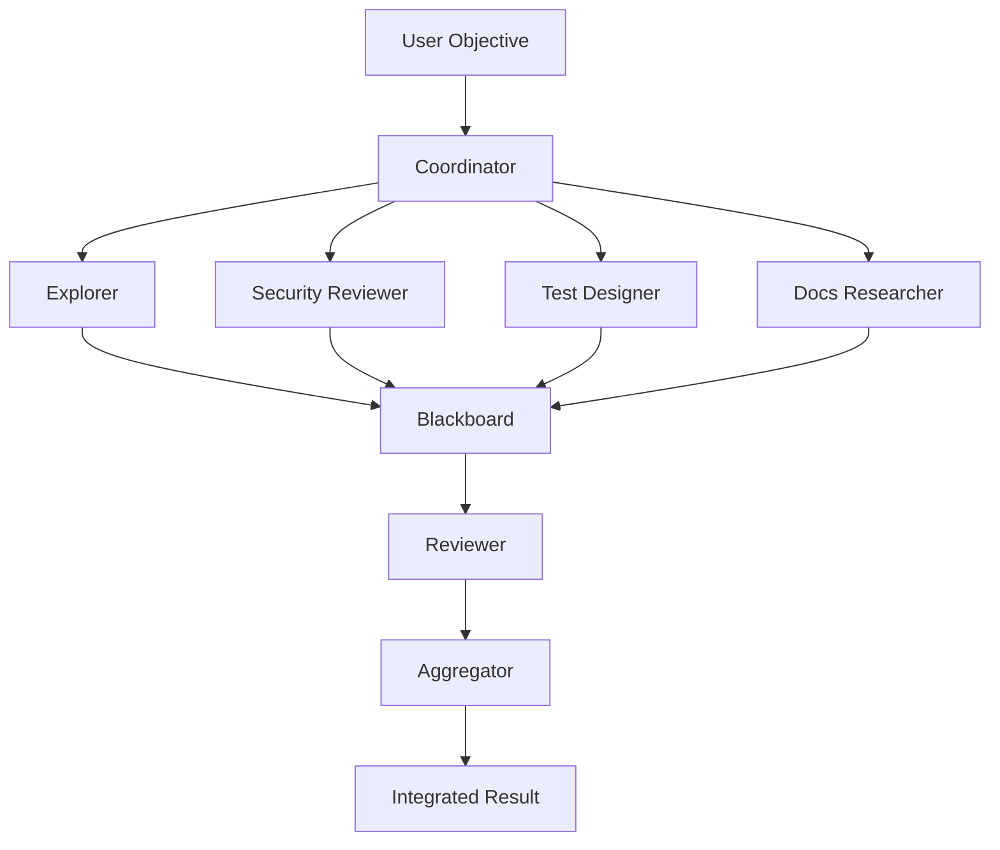
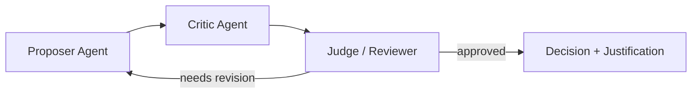
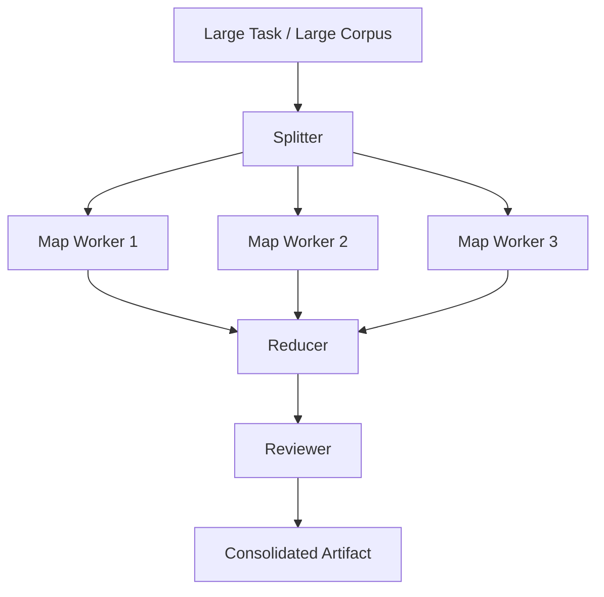
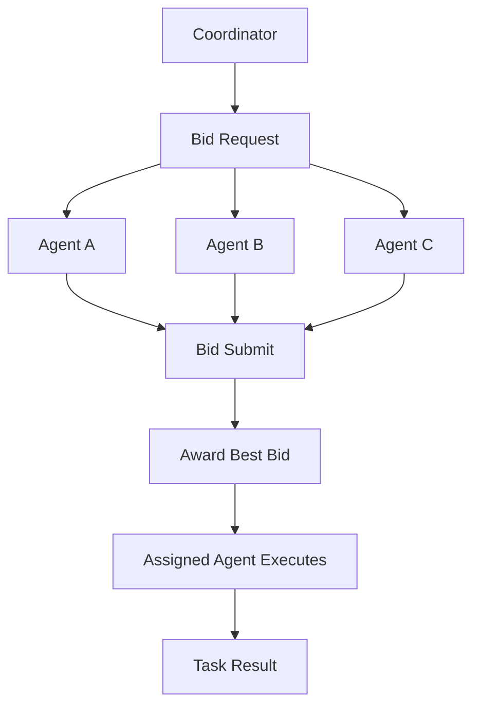
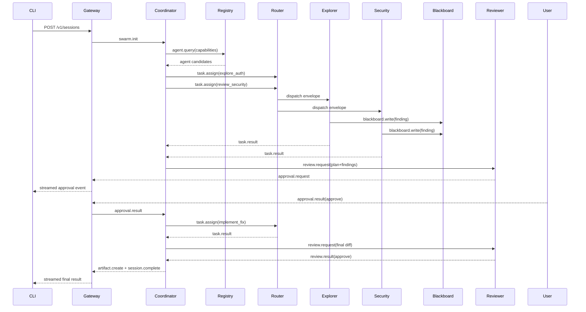
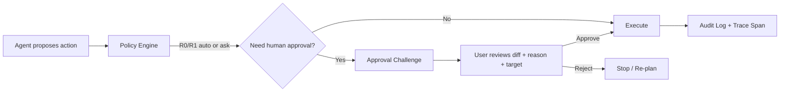

# 面向個人用戶的 Agent Swarm PRD 與技術設計研究

## Executive Summary

本報告的結論是：**面向個人用戶的 Agent Swarm，最終不應做成一個「會聊天的多代理殼層」，而應做成一個本地優先、CLI-first、可背景化、可審批、可回放的個人任務作業層**。它的外觀應接近今天先進 coding agent 的綜合形態：在 terminal 啟動與控制，在 IDE 旁審查計畫與 diff，在 desktop 或 browser 觀看任務圖、trace、artifact，在需要時把長任務交給雲端 runner 平行處理；同時，整個系統要能透過 SDK、HTTP/WebSocket、MCP 與外部工具連接，而不是被綁死在單一聊天介面。這個方向，已經在 Claude Code 的多介面與 subagent／skills／hooks／MCP 能力、Codex 的本地 CLI + 雲端平行背景執行 + app-server、OpenCode 的 TUI／web／headless server／JS SDK，以及 ForgeCode 的 shell-native 與專精 agent／語意檢索保護欄中清楚出現。citeturn12view0turn17view3turn17view4turn17view5turn14view6turn18view7turn18view9turn19view1turn19view2turn25search0turn25search2turn16view4turn13view3turn16view8

面向個人用戶時，差異化不在於「代理數量更多」，而在於 **更低的認知負擔、更低的運維門檻、更強的可控性與成本透明度**。與企業產品相比，個人產品不能假設有平台團隊、SSO、治理委員會或專職 DevOps；因此它必須默認安全、默認可解釋、默認可復原、默認可設定預算，並且讓使用者能自由切換模型供應商、在本機執行、必要時才雲端擴展。這一點之所以重要，是因為對標產品已經顯示出兩條路徑：一條是 Claude Code/Codex 的**預設審批與 sandbox**，另一條是 OpenCode/ForgeCode 的**高可自訂與多 provider**。面向個人用戶的最優解，應該是把兩者結合：**安全預設 + 供應商可攜 + 本地優先 + 任務圖透明**。citeturn12view1turn14view4turn18view4turn14view13turn19view3turn15view0turn16view10

本報告建議的首版產品形態是：**一個統一的 Swarm Gateway + Coordinator + Router + Blackboard + Reviewer/Approver + Aggregator 核心**，前端用 CLI 作為主入口，附一個輕量 web/desktop「Mission Control」作可視化審查；本地模式預設單機運行，託管模式再擴展為 NATS JetStream + Postgres + Redis + MinIO 的控制平面。邊界協議建議採用 **HTTP 建 session、WebSocket 串流事件、內部 message bus 用 NATS JetStream**；資料面則以 **Postgres 做 source of truth、Redis 做快取/鎖/短態、MinIO 做 artifact/object store、FS 做本地退化模式**。這樣的分層直接對應了 HTTP 的無狀態請求-回應模型、WebSocket 的雙向事件流、Redis Streams 的 append-only log 與 consumer groups、NATS JetStream 的內建持久化/重播，以及 Kafka 面向高吞吐大 backlog 的設計取向。citeturn10search8turn10search1turn13view10turn13view12turn13view13turn8search3turn13view16

未指定的細節，本報告一律**假設為無特定限制**：不預設企業 SSO、法規合規、特定雲供應商綁定、特定模型綁定、或語音/行動端必需；預設使用者是單人帳號、可接受本機安裝、希望在本地與雲端之間自由切換的技術型個人用戶。

| 北極星 KPI | Alpha 目標 | Beta 目標 | GA 目標 | 說明 |
|---|---:|---:|---:|---|
| 首次成功任務完成率 | 55% | 68% | 80% | 安裝後 10 分鐘內完成第一個有結果的 Swarm 任務 |
| 首份可審批計畫時間 p95 | 12 秒 | 10 秒 | 8 秒 | 指「產出第一份 plan/proposal」，不含最終整體任務完成 |
| 任務完成率 | 60% | 72% | 85% | 以使用者標記「完成且可接受」為準 |
| 系統控制面額外延遲 p95 | 150 ms | 100 ms | 80 ms | 不含 LLM 生成時間 |
| 中等任務平均成本 | ≤ US$1.50 | ≤ US$1.20 | ≤ US$1.00 | 含模型 + 工具 + 基礎設施攤銷 |
| 危險操作誤觸率 | <0.5% | <0.2% | <0.1% | 任何需要人類審批的 action 不得繞過 |
| Trace 完整率 | 90% | 95% | 99% | session、task、tool、approval 都可追溯 |

## 對標研究與產品定位

本報告主要對標 entity["company","Anthropic","ai company"] 的 Claude Code、entity["organization","OpenAI","ai lab"] 的 Codex、entity["company","Anomaly","developer tools company"] 的 OpenCode，以及 entity["company","Tailcall","developer tools company"] 的 ForgeCode。四者共同指出：agent 產品的「終局」，不是獨立聊天窗，而是**多介面一致的同一個 runtime**，同時具備本地執行、背景工作、可視化審查、擴充協議、任務委派、可重播 trace，以及安全/審批控制。citeturn12view0turn14view6turn19view1turn16view4

### Claude Code 的啟示

Claude Code 最值得借鏡的，不只是 terminal，而是**同一核心能力橫跨 terminal、IDE、desktop、browser、CI/CD**。官方文件明確把它定位為能讀 codebase、編輯檔案、執行命令、整合開發工具的 agentic coding tool，並提供 terminal、IDE、desktop、browser 等介面；在 VS Code 內，它已經把 plan review、permissions、MCP、hooks、memory、plugins 暴露為同一個 UX 面板中的一等功能。這代表個人 Swarm 的最終形態應該是「**一個 runtime，多個 view**」，而不是各端各做一套邏輯。citeturn12view0turn17view2turn20search7

Claude Code 第二個關鍵訊號是：**把安全與擴充都做成結構化能力，而不是隱性 prompt 習慣**。官方說明顯示，它預設在修改檔案前要求使用者批准；它同時把 hooks 定義成可在生命週期特定點執行的 user-defined shell commands，讓規則強制執行；又把 skills、subagents、MCP 變成可組合擴充層，其中 subagent 甚至有自己的 context window、tool access 與獨立 permissions。對個人 Swarm 來說，這直接說明了三件事：**要有明確的 approval state machine、要有 deterministic hook layer、要有真正隔離的子代理上下文**。citeturn12view1turn17view4turn17view3turn17view5turn17view0

### Codex 的啟示

Codex 展示的是另一種更完整的「平台化」方向：**本地 CLI、IDE、桌面 app、雲端 background runner、app-server、MCP server、subagents、plugins、skills、sandbox/approval/network controls** 共同構成一個完整的 agent operating surface。官方文件把 Codex CLI 定位為可在本機 terminal 讀、改、跑程式碼的 coding agent，且以 Rust 實作；同時又提供 Codex cloud，讓任務可在自己的 cloud environment 背景平行執行；再用桌面 app 把平行 threads、worktree、automations、Git 功能收斂成一個 command center。citeturn14view6turn18view7turn14view0

對 Personal Swarm 影響最大的，其實是 Codex 的**app-server / subagents / security** 三件事。官方 app-server 文件明說，它是 rich clients 的介面，提供 authentication、conversation history、approvals 與 streamed agent events；subagents 文件則把平行 agent workflow、custom agents、per-agent sandbox、max_threads/max_depth 都直接產品化；安全文件更把 sandbox、approval、network access、web search 風險拆開管理。這代表你的產品若要做「最終形態」，一定不能只停留在 CLI：**它必須有 app-server 級別的事件與審批協議、子代理的併發/深度限制、以及資源與網路的政策層**。citeturn18view9turn14view9turn14view10turn18view8turn14view4turn18view4turn18view5

此外，Codex 也明確把 MCP、plugins、skills、Agents SDK 接起來：MCP 可在 CLI/IDE 使用；plugins 可打包 app integration、skills、MCP servers；Agents SDK 可把 Codex 當成 MCP server 來組多代理工作流。這對你的產品定位很重要：**真正的「Swarm 產品」不是多代理本身，而是可被嵌入/擴展/治理的一個 agent platform**。citeturn18view2turn18view0turn18view1turn18view3

### OpenCode 的啟示

OpenCode 最有價值的地方，在於它證明了**開源、CLI-first、可程式化 server、web/TUI/IDE 多表面、provider-portable、本地模型**可以在同一產品中成立。官方文件把它定義為 open source AI coding agent，提供 terminal-based interface、desktop app 與 IDE extension；CLI 預設啟動 TUI，但也能以 `run`、`serve`、`web`、`attach` 等模式程式化使用，甚至能以 headless HTTP server 暴露 OpenAPI。這種「同一核心既可互動，也可被別的系統呼叫」的結構，非常接近你要做的個人 Swarm 終局。citeturn19view1turn19view2turn25search0turn25search2turn14view12

OpenCode 同時把**Plan mode、permission config、多 provider 和本地模型**做得很直接。官方文件指出，Plan mode 會關閉改動能力並只提出實作計畫；permission config 可把工具設成 allow / ask / deny；它支援 75+ LLM providers 並支援 local models；此外還有 JS/TS SDK、GitHub workflow integration、MCP servers、skills 與 plugins。這些訊號對個人用戶尤其重要：他們往往沒有企業級採購能力，更希望能用任意 provider、本機模型，或把 agent 接進自己的工具鏈。citeturn14view15turn14view13turn19view3turn15view0turn15view1turn14view12turn13view1turn15view5turn15view4turn14view14

不過，OpenCode 也給了反面教材。官方 config 文件寫得很清楚：**預設允許所有操作，不要求顯式批准**。對個人用戶而言，這個預設對於「試玩型 coding agent」可能可接受，但對一般性的 Personal Swarm 不是好選擇；你的產品應該採取 Claude/Codex 式的安全預設，而不是 allow-all。citeturn19view3turn12view1turn14view4

### ForgeCode 的啟示

ForgeCode 的定位非常鮮明：它不是一般聊天視窗，而是**shell-native 的 coding harness**。官方安裝頁把它描述成 CLI-based coding harness，強調可配多種 AI provider、可在 zsh prompt 內直接送 prompt；操作模型則明確切成 `muse`（規劃/分析）、`forge`（直接實作）、`sage`（內部研究工具）三個角色，並允許自訂 agent 放在 `~/forge/agents/` 或 `.forge/agents/`。對你的產品來說，這說明「Swarm UX」不一定要做成視覺化拼圖；它可以先是**shell 裡的結構化多代理操作系統**。citeturn16view4turn13view3turn13view4turn16view0turn16view6

ForgeCode 另一個很值得借鏡的點，是它把**project instructions、特殊 agents、語意檢索、tool-call guardrails**連成一體。AGENTS.md 被視為注入每次對話的 persistent instructions；ForgeCode Services 則加入 context engine、tool-call guardrails、skill engine，並可對專案做語意索引與 `sem_search`。這對 Personal Swarm 的意義是：**你需要一個更像 runtime 的「上下文與保護欄系統」，而不只是 prompt 模板**。citeturn16view5turn16view8turn16view9

### 綜合定位與差異化建議

綜合以上官方資料，我建議你的產品定位不是「另一個 coding agent」，而是：

| 面向 | 借鏡方向 | 面向個人用戶的差異化建議 |
|---|---|---|
| 介面 | Claude Code/Codex/OpenCode 的多介面一致 runtime | CLI 為主，IDE/desktop/web 為審查與觀測視圖；不做多套邏輯 |
| 委派 | Claude/Codex 的 subagents；ForgeCode 的角色型 agents | 任務圖與角色皆可見，限制 fan-out、深度、預算 |
| 擴充 | MCP、skills、plugins、AGENTS/CLAUDE.md | 支援 MCP + 專案規則檔 + 可安裝 skill packs |
| 安全 | Claude/Codex 的 approval/sandbox | 預設安全；所有高風險 side effect 必須人審 |
| 成本 | OpenCode/ForgeCode 的 provider portability | BYOM、local model、硬性預算、模型 tier fallback |
| 平台整合 | Codex app-server、OpenCode server/SDK | 一開始就定義 app-server / event stream，不把整合留到最後 |

## 目標願景與成功指標

如果把產品願景寫成一句話，我建議是：

> **讓個人用戶可以像管理一個小型工程團隊一樣，安全地指揮多個專精 agent，在本地與雲端之間自由切換，完成從理解、規劃、實作、驗證到交付的完整任務。**

這個願景之所以可行，是因為對標系統已經分別驗證了關鍵積木：Claude Code 證明了多介面一致性與受控擴充；Codex 證明了背景平行任務、app-server 與子代理治理；OpenCode 證明了 provider portability、本地模型與 headless server；ForgeCode 證明了 shell-native 與角色化 agents + semantic retrieval 的生產力價值。你的產品要做的不是重新發明其中任何一個點，而是把它們結合成**針對個人用戶最順手的 operating layer**。citeturn12view0turn17view3turn18view7turn18view9turn19view1turn25search2turn16view4turn16view8

我建議的最終形態，可以稱為 **Personal Swarm OS**，它應具備以下特性。第一，**CLI-first**：所有能力都必須先能在 terminal 中完整使用；GUI 只做可視化、審查、回放與設定。第二，**local-first**：預設在使用者本機資料夾與權限範圍內工作，雲端 runner 只是可選加速。第三，**task-graph-first**：系統內部的真實物件不是對話，而是 session、task、artifact、approval、trace。第四，**policy-first**：每一個 agent、工具、網路存取與外部副作用都要可被政策與預算限制。第五，**provider-portable**：不能綁單一模型供應商，因為個人用戶需要在價格、隱私、速度與品質之間做自由切換。這些方向都能在現在的基準產品裡找到對應訊號。citeturn15view0turn16view10turn24view0turn24view2

### 建議的產品北極星

| 類型 | KPI | Alpha | Beta | GA |
|---|---|---:|---:|---:|
| 啟動 | 安裝後 10 分鐘內完成第一個任務的比例 | 50% | 65% | 75% |
| 價值 | 每日活躍用戶 DAU | 100 | 1,000 | 5,000 |
| 品質 | 任務完成率 | 60% | 72% | 85% |
| 品質 | 需要使用者大幅重做的任務比例 | <35% | <25% | <15% |
| 速度 | 首份可審批計畫時間 p95 | 12 s | 10 s | 8 s |
| 速度 | 控制面事件派送延遲 p95 | 150 ms | 100 ms | 80 ms |
| 成本 | 中等任務平均成本 | ≤ US$1.50 | ≤ US$1.20 | ≤ US$1.00 |
| 安全 | 危險動作未經審批繞過率 | 0 | 0 | 0 |
| 可觀測性 | Trace 完整率 | 90% | 95% | 99% |

### 面向個人用戶的核心價值主張

| 價值主張 | 為何重要 | 產品化表現 |
|---|---|---|
| 可控自治 | 個人用戶沒有平台團隊替他踩煞車 | plan-before-act、approval gate、risk class |
| 可承受成本 | 個人用戶對 token/工具費用更敏感 | hard budget、soft budget、模型降級策略 |
| 可攜模型 | 個人用戶常同時用商業模型與本地模型 | provider abstraction、per-task model policy |
| 可回放結果 | 不是「它幫我做了什麼」，而是「它怎麼做的」 | trace、artifact、blackboard、audit log |
| 可擴充工作流 | 不是只寫 code，而是要處理真實生活/工作任務 | MCP、技能包、專案規則檔、headless API |
| 可低門檻安裝 | 多數個人用戶無法先安裝一整套平台 | 單指令安裝、Local mode、雲端 runner 選配 |

## 使用者人物誌與場景

下面的人物誌與場景，不是憑空想像，而是由目前對標產品已公開支持的工作流反推而來：包含 codebase 理解與改寫、Plan mode、平行背景任務、GitHub issue/PR 流程、MCP 工具接入、shell 工作流與本地模型切換。citeturn17view2turn14view9turn18view7turn20search1turn13view1turn16view4turn15view0

| 人物誌 / 場景 | 主要需求 | 主要痛點 | 成功標準 |
|---|---|---|---|
| **獨立開發者**：從 issue 到 PR 的一人產品開發 | 讀 repo、拆任務、修改多檔、補測試、產出 changelog | 任務跨檔案與跨工具，容易忘記上下文；怕 agent 一口氣改壞 | 30 分鐘內完成一個 feature branch，可 review 的 plan、diff、測試與提交訊息都齊全 |
| **OSS 維護者**：issue triage、PR review、release checklist | 平行檢查 bug report、重現步驟、風險、文件一致性 | issue 多、時間碎片化；人工 triage 耗時 | 一次指令產出 triage 結果、風險分級、建議回覆模板與 release note 草稿 |
| **接手陌生代碼庫的全端工程師** | 先理解架構，再規劃改動，再安全落地 | 新專案上下文巨大，直接讓 agent 改容易失控 | 先得到可審批計畫，再由執行 agent 分步實作，且每一步都有 trace 與 rollback 點 |
| **技術 PM / 研究型工作者** | 彙整文件、抓網頁、比對版本、生成 brief 或決策備忘錄 | 資料散落 repo、文件、網頁、issue tracker | 20 分鐘內拿到完整 brief，附來源、差異摘要與待確認事項 |
| **個人自動化玩家** | 把瀏覽器、檔案、試算表、email draft 串成一個流程 | 工具切換多、腳本維護麻煩、失敗難追 | 以自然語言啟動一個多步流程，所有 side effect 先經審批，結果可重播 |
| **安全敏感顧問 / 接案者** | 盡量本地執行、只在特定情況開網路、保留完整審計 | 客戶資料敏感；不能把 context 無限制送雲端 | 以 local-first 模式完成任務，且網路、檔案外寫、Git push 都有明確審批與日誌 |

### 場景解析與產品含義

對個人用戶來說，真正高頻的不是「叫 agent 寫一段程式」，而是**把一個含多步驟、跨工具、需審核的任務交給多個專精角色拆開做**。這正是 Claude Code 的 plan review、subagents 與 hooks；Codex 的 parallel subagents、background cloud、approval presets；OpenCode 的 plan/general/explore 與 GitHub integration；ForgeCode 的 `muse`/`forge`/`sage` 分工，所共同反映的工作方式。也因此，產品設計的中心必須從「prompt」轉到「task graph + review loop」。citeturn17view2turn17view3turn17view4turn14view9turn18view4turn18view7turn15view2turn13view1turn13view4turn16view0

## 核心架構與模組設計

從對標產品看，最合理的架構不是單一 agent 直接碰所有工具，而是把**使用者入口、任務協調、能力註冊、路由、共享工作記憶、審查與輸出**分層。這種分層也與現有公開產品的介面形態一致：Claude Code/Claude Agent SDK 的同核心多介面與 OpenTelemetry、Codex 的 app-server 與 streamed events、OpenCode 的 headless server 與 JS/TS SDK、ForgeCode 的檔案型 agents 與 shell workflows，都在暗示核心必須是一個可程式化 runtime，而不是單純聊天邏輯。citeturn24view0turn18view9turn25search2turn14view12turn16view6



### 模組責任、接口與非功能需求

> 下表中的介面與 NFR 是本報告的**工程設計提案**；延遲目標指控制面開銷，不含 LLM 本身推理時間。

| 模組 | 核心職責 | 代表接口 / API | 主要輸入 | 主要輸出 | NFR 目標 |
|---|---|---|---|---|---|
| **Swarm Gateway** | 建立 session、接收 CLI/SDK 請求、提供事件串流 | `POST /v1/sessions`、`WS /v1/sessions/{id}/events` | 使用者 prompt、workspace、policy、budget | `session_id`、事件流、approval challenge | p95 接入 < 150ms；Hosted 可用性 99.9% |
| **Coordinator** | 目標理解、任務拆解、DAG 管理、模式選擇 | `POST /v1/sessions/{id}/plan`、內部 `task.decompose` | objective、上下文、可用 agents、mode | task graph、assignment、review plan | 排程開銷 p95 < 100ms/transition |
| **Agent Registry** | agent capability、health、load、model profile 管理 | `PUT /v1/agents/{id}/heartbeat`、`GET /v1/agents?capability=` | agent card、health、負載 | capability lookup、候選 agent 集合 | lookup p95 < 20ms；心跳延遲容忍 10s |
| **Router** | 依 capability / role / policy 路由 envelope；重試、去重 | 內部 `route(envelope)`、`/v1/router/replay/{trace}` | SwarmEnvelope、policy、registry state | ack、dispatch、retry、DLQ | dispatch p95 < 30ms local / < 80ms hosted |
| **Blackboard** | 共享觀察、證據、decision、artifact refs | `POST /v1/blackboard/entries`、`GET /v1/blackboard/query` | findings、notes、evidence、decision | 可查詢共享狀態、版本化 entry | write p95 < 25ms；read p95 < 40ms |
| **Reviewer** | 風險檢查、品質審核、policy gate、要求修訂 | `POST /v1/reviews`、內部 `review.request` | task result、diff、risk hints | verdict、issues、approval request | 規則審核 p95 < 20ms；LLM review 最多 1-2 輪 |
| **Aggregator** | 合併多代理結果、形成最終 artifact | `POST /v1/aggregations` | 多個 task results、blackboard refs | summary、final artifact、confidence | 聚合額外開銷 p95 < 50ms |
| **CLI / SDK** | 人機交互、stream 顯示、resume/fork、程式調用 | `swarm run`、`swarm resume`、TS/Python SDK | 使用者命令、config、approval input | terminal UI、結構化 result、callbacks | CLI 冷啟動 < 2s；stream first event < 300ms |
| **Security / Approval** | 權限判定、危險操作升級審批、secret policy | `POST /v1/approvals`、`POST /v1/approvals/{id}:decide` | action、target、risk class、justification | allow/ask/deny、decision record | human response 後系統續跑 p95 < 100ms |
| **Billing / Resource Manager** | token/工具/存儲計量、配額、hard budget | `GET /v1/usage`、`POST /v1/budgets/check` | session usage、provider rates | remaining budget、throttle/stop decision | usage lag < 5s；budget 命中 100% 阻斷 |

### 代表 API 與 Envelope 範例

**建立 session**

```json
{
  "objective": "讀取目前 repo，提出重構計畫，實作登入錯誤修復，補測試並產出 PR 摘要",
  "mode": "parallel-expert",
  "workspace": {
    "root": ".",
    "trusted": true
  },
  "providers": {
    "default": "openai/gpt-5.4",
    "fallback": ["anthropic/claude-sonnet-4", "local/qwen3-coder"]
  },
  "policy": {
    "approval_mode": "on-request",
    "network_access": "allowlist",
    "allow_domains": ["docs.python.org", "developer.mozilla.org"]
  },
  "budget": {
    "max_cost_usd": 2.0,
    "max_tokens": 300000,
    "max_agents": 6
  }
}
```

**內部任務派送 Envelope**

```json
{
  "id": "env_01JX...",
  "schema_version": "asp/1.0",
  "swarm_id": "swm_01JX...",
  "session_id": "ses_01JX...",
  "task_id": "task_fix_login",
  "from": { "agent_id": "coordinator" },
  "to": { "capability": "code.implement" },
  "type": "task.assign",
  "intent": "implement.login_fix",
  "correlation_id": "corr_01JX...",
  "created_at": "2026-05-05T10:00:00+09:00",
  "ttl_ms": 1800000,
  "priority": "high",
  "routing": {
    "mode": "any",
    "require_ack": true,
    "retry": { "max_attempts": 2, "backoff_ms": 500 }
  },
  "trace": {
    "trace_id": "trace_01JX...",
    "span_id": "span_router_01"
  },
  "auth": {
    "actor_id": "usr_123",
    "scopes": ["workspace.read", "workspace.write", "git.read"],
    "approval_mode": "on-request"
  },
  "payload": {
    "workspace_root": ".",
    "target_files": ["auth/login.ts", "auth/login.test.ts"],
    "acceptance_criteria": [
      "修正登入失敗重試 bug",
      "補上單元測試",
      "不得修改 API 合約"
    ]
  }
}
```

### 技術棧比較與建議

以下比較綜合 Redis Streams、NATS JetStream、Kafka、HTTP、WebSocket、PostgreSQL、MinIO、Kubernetes 與 entity["company","Amazon Web Services","cloud platform"] Lambda 官方文件，以及上述產品對流式事件、背景任務、SDK/server integration 的實際公開形態來做工程判斷；表中的「推薦」屬本報告推論，而非原廠 SLA。citeturn13view10turn13view12turn13view13turn10search8turn10search1turn8search3turn13view16turn13view14turn13view15

#### Transport

| 技術 | 優點 | 缺點 | 適合位置 | 建議 |
|---|---|---|---|---|
| **HTTP** | 最簡單、普遍、便於 CLI/SDK/REST 與 auth | 無法自然表達長流事件與 fan-out | 外部 north-south API | **必選**：建立 session、查詢狀態、approval callback |
| **WebSocket** | 雙向、低延遲、適合流式 event / approval / trace | 要管理連線狀態、重連與 backpressure | UI 事件流、CLI live stream | **必選**：用於 session event stream |
| **Redis Streams** | append-only log、consumer groups、單機友好、部署簡單 | 跨叢集與長線歷史處理不如 Kafka；服務治理能力不如 NATS | 小型自架、單節點 hosted、local dev | **候選**：Alpha 自架/本地 fallback |
| **NATS JetStream** | 低延遲 pub/sub + 持久化/重播；服務導向強 | 生態不如 Kafka 廣，但對本案已足夠 | 內部 agent bus、control-plane events | **首選**：Hosted 內部 message bus |
| **Kafka** | 高吞吐、大 backlog、長時間保留與資料管線能力強 | 太重、維運成本高、對個人產品過度設計 | 大規模多租戶資料流 | **不進 MVP**；GA 也僅在超大規模需要時考慮 |

#### Runtime

以下比較綜合 Claude Agent SDK 的 Python/TypeScript、OpenAI Agents SDK 的 TypeScript 與 tracing/handoff 能力、Codex SDK 的 TypeScript/Python、以及 OpenCode 的 JS/TS SDK 做判斷。結論是：**控制平面與 CLI 用 Node/TypeScript；專精工具/研究 agent 可讓 Python 補位；Go 保留給基礎設施與高效 sidecar，不作主 runtime**。citeturn24view0turn24view2turn24view4turn14view12

| Runtime | 優點 | 缺點 | 適合位置 | 建議 |
|---|---|---|---|---|
| **Node / TypeScript** | CLI、WebSocket、MCP、生態最順；前後端共型別；最接近主流 agent SDK 與 JS ecosystem | CPU 密集工作較弱 | Gateway、Coordinator、Router、CLI、Web SDK | **首選主 runtime** |
| **Python** | 最適合研究、資料處理、ML/LLM tooling、生態成熟 | CLI/TUI 與長期多端一致性不如 TS；型別/發佈一致性稍差 | Research agent、analysis worker、特殊 tool adapter | **次要 runtime** |
| **Go** | 單 binary、效能穩定、併發優秀、適合 sidecar/services | 当前 agent SDK / prompt 工程生態不是最強 | telemetry collector、policy proxy、高效工具服務 | **基礎設施補位，不作主線** |

#### Storage

| 技術 | 優點 | 缺點 | 適合資料 | 建議 |
|---|---|---|---|---|
| **Postgres** | 可靠、交易一致、查詢彈性高 | 當高速 queue 不理想 | sessions、tasks、approvals、audit、blackboard index | **SoT 首選** |
| **Redis** | 低延遲、適合快取、鎖、rate limit、短態 | 不適合作唯一持久化 SoT | hot cache、session state、locks、quota counters | **必配** |
| **MinIO** | S3 相容、適合 artifact/object store | 不是關聯查詢庫 | patch、logs bundle、reports、snapshots | **Hosted artifact 首選** |
| **FS** | 最簡單、對 local mode 友善 | 無 HA、跨裝置與多進程協作差 | 單機 local artifacts、暫存、export | **Local mode 必備** |

#### Orchestration

| 技術 | 優點 | 缺點 | 適合階段 | 建議 |
|---|---|---|---|---|
| **Local** | 最低門檻、最符合個人隱私與單機工作流 | 無 HA、跨機器併發有限 | Alpha、離線與隱私敏感模式 | **預設模式** |
| **Kubernetes** | declarative updates、autoscaling、部署標準化 | 運維複雜、學習曲線高 | Hosted Beta/GA、多租戶或 burst runners | **GA 首選** |
| **Serverless** | 不管伺服器、自動縮放、按用量計費 | 冷啟動、可變延遲、長任務/有狀態流程不友善 | webhooks、approval callbacks、短控制面任務 | **只用於 stateless edge，不跑長壽命 swarm workers** |

### 總體技術建議

基於以上比較，我建議：

1. **Alpha**：Local mode 為主；Node/TS 單一 codebase；HTTP + WebSocket；Postgres（或可替換本地 DB 層）+ FS；message bus 可先 in-process，外加 Redis fallback。
2. **Beta**：引入 NATS JetStream、Redis、MinIO；CLI + minimal Mission Control；支援 hosted burst runner。
3. **GA**：以 Kubernetes 托管控制平面與 workers；保留 local mode；edge callbacks 才考慮 serverless。

## 協議、資料模型與工作流

協議設計的核心原則，是把「聊天」降級成外部交互形式，而把 **Envelope、Session、Task、AgentCard、Blackboard、Approval、Artifact、Trace** 提升為平台原生物件。這種做法，與 Claude Code/Codex 的 subagent 與 project instructions、Codex app-server 與 MCP server、OpenCode 的 server/SDK、ForgeCode 的 file-based agents／AGENTS.md 非常一致：真正可持久化與可治理的，都是結構化物件，不是自然語言對話本身。citeturn17view3turn14view11turn18view9turn18view3turn25search2turn16view6turn16view5

### TypeScript Schema

```ts
export type RiskClass = "r0" | "r1" | "r2" | "r3" | "r4";
export type Priority = "low" | "normal" | "high" | "critical";
export type ApprovalMode = "read-only" | "on-request" | "on-failure" | "auto";
export type RoutingMode = "direct" | "broadcast" | "any" | "all" | "capability" | "role";

export type AgentAddress = {
  agent_id?: string;
  role?: string;
  capability?: string;
  instance_id?: string;
};

export type SwarmMessageType =
  | "swarm.init"
  | "swarm.update"
  | "swarm.close"
  | "agent.register"
  | "agent.heartbeat"
  | "task.plan"
  | "task.create"
  | "task.assign"
  | "task.accept"
  | "task.reject"
  | "task.progress"
  | "task.result"
  | "task.fail"
  | "task.cancel"
  | "review.request"
  | "review.result"
  | "approval.request"
  | "approval.result"
  | "blackboard.write"
  | "blackboard.update"
  | "artifact.create"
  | "artifact.update"
  | "error"
  | "ack";

export interface TraceContext {
  trace_id: string;
  span_id: string;
  parent_span_id?: string;
  workflow_name?: string;
  task_path?: string[];
}

export interface BudgetPolicy {
  max_cost_usd?: number;
  max_tokens?: number;
  max_tool_calls?: number;
  max_wall_time_ms?: number;
  max_agents?: number;
}

export interface RoutingPolicy {
  mode: RoutingMode;
  require_ack?: boolean;
  ack_timeout_ms?: number;
  retry?: {
    max_attempts: number;
    backoff_ms: number;
  };
}

export interface AuthContext {
  actor_id: string;
  scopes: string[];
  approval_mode: ApprovalMode;
  session_trust: "trusted" | "untrusted";
  delegated_by?: string[];
}

export interface SwarmEnvelope<T = unknown> {
  id: string;
  schema_version: "asp/1.0";
  swarm_id: string;
  session_id: string;
  task_id?: string;
  subtask_id?: string;
  from: AgentAddress;
  to: AgentAddress | AgentAddress[];
  type: SwarmMessageType;
  intent: string;
  correlation_id?: string;
  reply_to?: string;
  idempotency_key?: string;
  created_at: string;
  ttl_ms?: number;
  priority: Priority;
  risk_class?: RiskClass;
  routing?: RoutingPolicy;
  trace: TraceContext;
  auth: AuthContext;
  budget?: BudgetPolicy;
  payload: T;
}

export interface SwarmSession {
  session_id: string;
  swarm_id: string;
  objective: string;
  status:
    | "created"
    | "planning"
    | "running"
    | "reviewing"
    | "waiting_approval"
    | "aggregating"
    | "completed"
    | "failed"
    | "cancelled";
  mode: "pipeline" | "parallel-expert" | "debate" | "map-reduce" | "market";
  workspace: {
    root: string;
    trusted: boolean;
    vcs?: {
      type: "git";
      branch?: string;
      worktree?: string;
    };
  };
  policy: {
    approval_mode: ApprovalMode;
    network_access: "deny" | "allowlist" | "allow";
    allow_domains?: string[];
    max_depth: number;
    max_concurrency: number;
    require_reviewer: boolean;
    human_approval_for: string[];
  };
  budget: BudgetPolicy;
  created_by: string;
  created_at: string;
  updated_at: string;
  tags?: string[];
  metadata?: Record<string, unknown>;
}

export interface SwarmTask {
  task_id: string;
  parent_task_id?: string;
  session_id: string;
  title: string;
  description: string;
  type:
    | "planning"
    | "research"
    | "implementation"
    | "testing"
    | "review"
    | "aggregation"
    | "tool-call";
  status:
    | "created"
    | "queued"
    | "assigned"
    | "running"
    | "blocked"
    | "waiting_approval"
    | "completed"
    | "failed"
    | "cancelled";
  required_capabilities: string[];
  preferred_agents?: string[];
  dependencies?: string[];
  assigned_to?: AgentAddress;
  risk_class: RiskClass;
  inputs: {
    workspace_root?: string;
    files?: string[];
    prompt?: string;
    artifact_refs?: string[];
    blackboard_refs?: string[];
    extra?: Record<string, unknown>;
  };
  expected_output: {
    format: "text" | "json" | "markdown" | "patch" | "artifact";
    schema_name?: string;
  };
  acceptance_criteria: string[];
  timeout_ms?: number;
  retry_policy?: {
    max_attempts: number;
    backoff_ms: number;
  };
  created_at: string;
  updated_at: string;
}

export interface AgentCard {
  agent_id: string;
  version: string;
  role: string;
  description: string;
  capabilities: string[];
  runtime: {
    language: "typescript" | "python" | "go";
    execution: "local" | "container" | "remote";
  };
  model_profile?: {
    default_model?: string;
    fast_model?: string;
    reasoning_model?: string;
    local_model?: string;
  };
  permissions: {
    file_read: boolean;
    file_write: boolean;
    shell: "deny" | "ask" | "allow";
    network: "deny" | "allowlist" | "allow";
  };
  health: {
    status: "idle" | "busy" | "degraded" | "offline";
    last_heartbeat_at: string;
    avg_latency_ms?: number;
    success_rate?: number;
  };
  limits: {
    max_concurrency: number;
    max_runtime_ms?: number;
    max_context_tokens?: number;
  };
  metadata?: Record<string, unknown>;
}

export interface BlackboardEntry {
  entry_id: string;
  session_id: string;
  task_id?: string;
  namespace: string;
  key: string;
  type:
    | "observation"
    | "evidence"
    | "finding"
    | "decision"
    | "plan"
    | "result"
    | "artifact_ref"
    | "note";
  visibility: "session" | "task" | "private";
  value: unknown;
  confidence?: number;
  source?: {
    agent_id?: string;
    tool_name?: string;
    uri?: string;
    file?: string;
    line_start?: number;
    line_end?: number;
  };
  trace_id: string;
  version: number;
  created_at: string;
  updated_at?: string;
}
```

### JSON 範例

**SwarmSession**

```json
{
  "session_id": "ses_01JXABC",
  "swarm_id": "swm_01JXABC",
  "objective": "讀 repo、提出重構計畫、修 login bug、補測試並產出 PR 摘要",
  "status": "planning",
  "mode": "parallel-expert",
  "workspace": {
    "root": "/Users/alice/work/app",
    "trusted": true,
    "vcs": {
      "type": "git",
      "branch": "fix/login-retry"
    }
  },
  "policy": {
    "approval_mode": "on-request",
    "network_access": "allowlist",
    "allow_domains": ["developer.mozilla.org", "docs.python.org"],
    "max_depth": 2,
    "max_concurrency": 4,
    "require_reviewer": true,
    "human_approval_for": ["git.push", "email.send", "workspace.outside_write"]
  },
  "budget": {
    "max_cost_usd": 2,
    "max_tokens": 300000,
    "max_wall_time_ms": 1800000,
    "max_agents": 6
  },
  "created_by": "usr_123",
  "created_at": "2026-05-05T10:00:00+09:00",
  "updated_at": "2026-05-05T10:00:00+09:00"
}
```

**BlackboardEntry**

```json
{
  "entry_id": "bb_01JXDEF",
  "session_id": "ses_01JXABC",
  "task_id": "task_explore_auth",
  "namespace": "auth",
  "key": "login.retry-loop",
  "type": "finding",
  "visibility": "session",
  "value": {
    "summary": "retry counter is reset on redirect",
    "severity": "medium",
    "recommendation": "move counter to persisted session state"
  },
  "confidence": 0.92,
  "source": {
    "agent_id": "explorer_01",
    "file": "src/auth/login.ts",
    "line_start": 88,
    "line_end": 124
  },
  "trace_id": "trace_01JX...",
  "version": 1,
  "created_at": "2026-05-05T10:02:11+09:00"
}
```

### 協作模式流程圖

下面的流程圖不是抽象教科書模式，而是針對前述對標產品已經公開驗證的實際交互形態——plan/review、parallel subagents、專精角色與 background workers——重新整理成可實作的產品工作流。citeturn17view2turn14view9turn15view2turn16view0

#### Pipeline



#### Parallel-Expert



#### Debate



#### Map-Reduce



#### Market



### 端到端 CLI 使用範例

**命令**

```bash
swarm run \
  "讀取目前 repo，先用探索與安全 reviewer 分析登入模組，再提出可審批計畫，獲批准後實作 bug fix、補測試、產出 PR 摘要" \
  --mode parallel-expert \
  --approval on-request \
  --budget usd:2 \
  --max-agents 6 \
  --provider default=openai/gpt-5.4 \
  --provider fallback=anthropic/claude-sonnet-4 \
  --provider local=qwen3-coder \
  --mcp filesystem,git,github,browser,docs \
  --review required
```

**背後的消息序列**



**建議採用的內部事件順序**

| 階段 | 事件 |
|---|---|
| 建 session | `swarm.init` |
| 查 agent | `agent.query` / `agent.register` / `agent.heartbeat` |
| 拆任務 | `task.plan` / `task.create` |
| 派工 | `task.assign` / `task.accept` |
| 共享狀態 | `blackboard.write` / `blackboard.update` |
| 審核 | `review.request` / `review.result` |
| 升級審批 | `approval.request` / `approval.result` |
| 交付 | `artifact.create` / `session.complete` |

## 安全、審計、可觀察性與運營

安全設計必須以「**個人用戶也能看懂、也能確信不會失控**」為前提。Claude Code 與 Codex 都把 approval、sandbox、network controls 做成一等公民；OpenCode 雖然可高度自訂，但預設為 allow-all；OpenAI Agents SDK 也把 tracing、guardrails、human in the loop、interruptions 暴露成原生概念。這些都說明：若要做個人 Swarm，**安全不是附加功能，而是主流程的一部分**。citeturn12view1turn14view4turn18view4turn19view3turn24view2turn24view3turn24view1

### 權限模型

我建議採用五層權限判定：

| 層次 | 作用 | 例子 |
|---|---|---|
| **User Intent** | 使用者當前任務的明示授權 | 「可以修改 repo 內檔案，但不要推送遠端」 |
| **Session Policy** | 該 session 的 safety/budget/network policy | `approval_mode=on-request`、`network=allowlist` |
| **Agent Capability** | agent 自身允許做什麼 | `explorer=read-only`、`implementer=workspace-write` |
| **Tool Permission** | 特定工具級別 allow/ask/deny | `bash=ask`、`browser=allow`、`git.push=deny` |
| **Resource Scope** | 實際資源邊界 | 工作目錄、allowlist domain、artifact bucket、MCP server |

建議的風險分級如下：

| 風險級別 | 代表操作 | 預設策略 |
|---|---|---|
| **R0** | workspace 內唯讀、規劃、摘要、搜尋 | 自動允許 |
| **R1** | workspace 內寫檔、跑測試、無網路 shell | 預設 `ask`，可在 session 內暫時放行 |
| **R2** | workspace 外寫入、套件安裝、網路抓取、live web | 必須審批 |
| **R3** | `git push`、PR comment、email send、deploy、對外 API side effect | 每次都需人類審批，附摘要與影響範圍 |
| **R4** | 刪庫、刪大量檔、匯出 secrets、不可逆 destructive 操作 | 預設 deny；除非顯式 break-glass 流程 |

### 危險操作的人類審批流程



**審批 challenge** 至少要包含六個欄位：`action`、`target`、`why_now`、`risk_class`、`predicted_impact`、`rollback_plan`。若是多檔案改動，還要提供**摘要 diff**；若是外部 side effect，還要提供**將要呼叫的 endpoint / repo / branch / recipient**。

### 審計日誌格式

```json
{
  "audit_id": "aud_01JX...",
  "ts": "2026-05-05T10:05:11+09:00",
  "session_id": "ses_01JXABC",
  "trace_id": "trace_01JX...",
  "actor_type": "agent",
  "actor_id": "implementer_01",
  "user_id": "usr_123",
  "action": "git.push",
  "resource": {
    "type": "git.remote",
    "repo": "origin",
    "branch": "fix/login-retry"
  },
  "risk_class": "r3",
  "decision": "approved",
  "approved_by": "usr_123",
  "reason": "Push feature branch for review",
  "checksum": "sha256:...",
  "idempotency_key": "git.push:origin:fix/login-retry:01"
}
```

### 保留策略

| 資料類型 | Local mode | Hosted mode 建議 | 說明 |
|---|---|---|---|
| Audit logs | 直到使用者刪除 | 180 天 | 需要做安全與故障追溯 |
| Trace / spans | 直到使用者刪除 | 30 天 | 主要用於 debug、成本分析、品質回溯 |
| Blackboard entries | session close 後可保留 | 14–30 天 | 避免工作記憶無限制累積 |
| Artifacts / reports | 由使用者決定 | 30–90 天 | 完整報告、patch bundle、export |
| Secrets 明文 | **不保留** | **不保留** | 僅保留 secret reference / vault id |

### 可觀察性與追溯

Observability 建議直接採 **trace/span-first** 設計。這不是空想：OpenAI Agents SDK 內建 tracing，會記錄 LLM generations、tool calls、handoffs、guardrails 與 custom events；Anthropic 的 Agent SDK 概覽則把 OpenTelemetry 與 cost tracking 列為核心 observability 能力。你的產品應該把這些觀念直接內建，而不是後補。citeturn24view1turn24view2turn24view0

建議的 trace 結構：

| Span 類型 | 代表事件 |
|---|---|
| `session_span` | 整個使用者任務 |
| `plan_span` | 目標理解與 DAG 生成 |
| `agent_span` | 單一 agent 執行段 |
| `tool_span` | bash、file edit、browser、MCP tool call |
| `review_span` | Reviewer 判定 |
| `approval_span` | 等待人審與決策 |
| `aggregation_span` | 合併結果與產物輸出 |

建議上報的 metrics：

| 類別 | 指標 |
|---|---|
| 產品 | `daily_active_users`, `sessions_started`, `task_completion_rate`, `approval_accept_rate` |
| 效能 | `gateway_latency_ms`, `router_dispatch_ms`, `blackboard_read_ms`, `event_stream_lag_ms` |
| 模型 | `tokens_in`, `tokens_out`, `llm_rounds`, `model_fallback_count` |
| 成本 | `cost_usd_per_session`, `cost_usd_per_task`, `artifact_storage_bytes` |
| 安全 | `approval_requests_total`, `denied_actions_total`, `network_block_total`, `policy_violation_total` |
| 品質 | `review_reject_rate`, `tool_retry_rate`, `session_resume_success_rate` |

### 錯誤處理、SLA 與資源配額

建議把錯誤分成四類：**可重試的基礎設施錯誤、可重試的模型錯誤、不可重試的政策錯誤、需人判斷的語義錯誤**。對應策略如下：

| 錯誤類型 | 策略 |
|---|---|
| Queue/IO/暫時性網路錯誤 | 自動 retry + backoff |
| 模型超時/供應商限流 | fallback to cheaper/faster model 或切換 provider |
| 權限/政策拒絕 | 中止該 task，產生 approval 或 re-plan |
| 語義錯誤 / 低信心輸出 | 進入 reviewer 回圈或要求人工介入 |

SLA 建議分成兩條線。**Local mode** 是 best effort，不承諾 SLA；**Hosted mode** 才有明確承諾：Gateway 99.9%、背景 runner 99.5%、artifact 存取 99.9%。資源配額則建議以 session 為單位：`max_agents`、`max_depth`、`max_tool_calls`、`max_wall_time`、`max_tokens`、`max_storage_bytes` 都可以硬限制，任何超限都必須觸發 budget event 或直接停止。

## PRD、里程碑與工程路線圖

### 產品定義

**產品名稱（暫定）**：Personal Swarm  
**定位**：給個人技術用戶的本地優先多代理工作作業層  
**核心用戶**：獨立開發者、接案工程師、OSS 維護者、技術 PM、研究/自動化 power user  
**核心問題**：現有 agent 工具通常擅長單回合或單 agent；一旦任務跨檔案、跨工具、跨時間、需要審批與回放，就容易失控、難追、難控成本  
**產品原則**：可控優先、任務圖優先、本地優先、供應商可攜、結果可回放

### 功能清單

| MoSCoW | 功能 |
|---|---|
| **Must** | CLI-first 入口、SwarmSession/Task Graph、Planner/Reviewer/Aggregator、MCP 接入、workspace 權限、approval gate、trace/audit、artifact export、budget control |
| **Should** | IDE extension、Mission Control web/desktop、provider fallback、本地模型支援、自訂 agents/skills、Git/GitHub 工作流、resume/fork session |
| **Could** | 插件市場、ACP editor bridge、手機審批、語音控制、共享模板社群 |
| **Won't** | 企業級多租戶 admin console、全功能 no-code builder、預設全自動 deploy、跨使用者共享長期記憶 |

### MVP 範圍

MVP 只做會直接影響「個人是否願意每天打開」的能力，不做平台秀肌肉：

| 類型 | MVP 包含 | MVP 不包含 |
|---|---|---|
| 入口 | CLI、簡易 web Mission Control | 完整桌面 app、行動端 |
| 協作 | Pipeline、Parallel-Expert、Reviewer 回圈 | Market bidding 全功能、複雜多租戶共享 |
| 工具 | filesystem、git、bash、browser、web docs、GitHub | email send、calendar、payments |
| 安全 | approval gate、risk classes、network allowlist、audit log | 企業 SSO、細粒度組織治理 |
| 部署 | local mode、選配 hosted burst runner | 跨 region 高可用 |
| 模型 | 至少 2 家雲供應商 + 1 類本地模型 | 海量模型 marketplace |

### 里程碑

以 **2026-05-05** 為規劃起點，建議三階段：

| 階段 | 時程估算 | 主要交付物 |
|---|---|---|
| **Alpha** | 10 週，目標 2026-07 中旬 | CLI、Gateway、Coordinator、Router、Registry、Blackboard、基本 envelope protocol、Pipeline/Parallel-Expert、approval gate、audit/trace、filesystem/git/bash/browser、local mode |
| **Beta** | 12 週，目標 2026-10 上旬 | Reviewer/Aggregator、Mission Control、GitHub integration、MCP manager、provider fallback、budget control、hosted burst runner、NATS/Redis/MinIO、resume/fork、自訂 agents/skills |
| **GA** | 14 週，目標 2027-01 中旬 | IDE extension、Kubernetes hosted plane、artifact retention policies、semantic retrieval、plugin packaging、資源配額、SLA hardening、細緻 metrics dashboard、文件與範例完成 |

### 成功指標

| 指標 | Alpha | Beta | GA |
|---|---:|---:|---:|
| DAU | 100 | 1,000 | 5,000 |
| 首次 10 分鐘成功率 | 50% | 65% | 75% |
| 任務完成率 | 60% | 72% | 85% |
| 平均 session 長度 | 12 分鐘 | 18 分鐘 | 22 分鐘 |
| 首份可審批計畫時間 p95 | 12s | 10s | 8s |
| 平均成本/任務 | ≤ US$1.50 | ≤ US$1.20 | ≤ US$1.00 |
| approval accept rate | 55% | 65% | 75% |
| review reject 後成功修訂率 | 40% | 55% | 70% |

### 主要風險與緩解措施

| 風險 | 影響 | 緩解措施 |
|---|---|---|
| 多代理 fan-out 造成成本爆炸 | 成本失控、使用者流失 | `max_depth`、`max_agents`、soft/hard budgets、model tier fallback |
| 預設太危險 | 誤修改、誤推送、信任崩潰 | safe-by-default、risk classes、R3/R4 強制審批 |
| 上下文膨脹與黑板污染 | 品質下降、token 浪費 | Blackboard TTL、entry type、confidence、review pruning |
| 插件/MCP 風險 | prompt injection、secret 外洩 | allowlist/denylist、scoped credentials、network policy、tool sandbox |
| 產品太像平台、太難上手 | 激活率低 | CLI 單命令起步、預設模板、只暴露必要概念 |
| Local 與 Hosted 行為不一致 | debug 困難 | 共用協議、共用 app-server/event model、contract tests |

### 工程任務清單與人力估算

| 任務 | 優先級 | 估算人月 | 說明 |
|---|---|---:|---|
| API / Gateway | P0 | 2.0 | session API、stream、auth、resume/fork |
| Coordinator / Task Graph | P0 | 3.0 | planning、DAG、mode selection、re-plan |
| Router | P0 | 1.5 | capability routing、retry、idempotency、DLQ |
| Agent Registry | P0 | 1.0 | agent card、heartbeat、load、lookup |
| Blackboard | P0 | 2.0 | entry CRUD、query、versioning、TTL |
| Reviewer / Aggregator | P1 | 2.0 | verdict、merge、confidence、artifact export |
| Agent SDK（TS） | P1 | 1.5 | session client、stream client、approval callbacks |
| Agent SDK（Python） | P2 | 1.0 | research/tool worker client |
| CLI / TUI | P0 | 3.0 | `run/resume/fork/status/export`、stream UX |
| Security / Approval / Audit | P0 | 2.0 | policy engine、risk classes、audit schema |
| Budget / Resource Manager | P1 | 1.5 | token/cost/storage/timeout accounting |
| Storage / Artifact layer | P0 | 1.0 | Postgres schema、MinIO/FS adapter |
| 測試（contract/e2e/load） | P0 | 2.5 | protocol tests、replay tests、chaos tests |
| 部署 / 本地安裝 / CI-CD | P0 | 2.0 | installer、docker/k8s manifests、release pipeline |
| Mission Control（Web） | P1 | 2.0 | task graph、trace viewer、approval UI |
| IDE extension | P2 | 2.0 | file context、plan review、inline approval |
| 文件 / 範例 / 模板 | P1 | 1.0 | quickstart、sample agents、sample skills |

**總估算：** 約 **28 人月**。  
較務實的團隊配置是：**1 位技術負責人、2 位 TypeScript 全端/平台工程師、1 位後端/基礎設施工程師、1 位 DX/測試工程師（可兼）**。若要壓到 6–8 個月內完成，建議 GA 前不要同時追求完整桌面 app、plugin marketplace 與企業治理能力。

### 最終產品規格建議

如果要把這份研究濃縮成一句明確的產品要求，那就是：

> **把 Agent Swarm 做成個人用戶的「任務作業層」：CLI-first、本地優先、雲端可選、任務圖可見、審批可控、結果可回放、模型可切換、工具可插拔。**

換句話說，最終產品應該長這樣：

1. **入口像 Claude Code / Codex / OpenCode / ForgeCode 一樣自然**：在 terminal 啟動，在 IDE/desktop/web 裡看同一個 session，而不是四套產品。
2. **內核像一個小型 orchestrator**：Coordinator、Router、Registry、Blackboard、Reviewer、Aggregator 是產品內建，不要求使用者自己拼。
3. **安全預設像 Codex/Claude Code 一樣嚴謹**：任何高風險操作必須可被攔截、審批、回放。
4. **供應商策略像 OpenCode/ForgeCode 一樣靈活**：支援 BYOM、本地模型、雲端模型與 fallback。
5. **可程式化程度像 Codex app-server/OpenCode server 一樣完整**：CLI 只是第一個 client，不是唯一 client。

### 主要參考來源

本報告優先採用官方/原始來源；中文官方資料有限時，採官方英文文件並以繁體中文分析呈現。主要參考來源包括：Claude Code 與 Claude Agent SDK 官方文件。citeturn12view0turn12view1turn17view3turn17view4turn17view5turn24view0

同時也大量參考了 Codex 官方文件與 OpenAI Agents SDK 官方文件，尤其是 CLI、cloud、app-server、subagents、MCP、skills、plugins、approval/security、streaming approvals 與 tracing。citeturn14view6turn18view7turn18view9turn14view9turn18view0turn18view1turn18view2turn18view3turn18view4turn24view1turn24view2turn24view3

對開源與多 provider/本地模型方向的判斷，主要依據 OpenCode 與 ForgeCode 官方文件，包括 OpenCode 的 TUI/web/server/SDK/permissions/providers/GitHub/MCP，以及 ForgeCode 的 shell-native 安裝、專精 agents、自訂 agents、AGENTS.md 與 ForgeCode Services。citeturn19view1turn19view2turn25search0turn25search2turn14view13turn15view0turn13view1turn15view5turn16view4turn13view3turn16view0turn16view6turn16view5turn16view8turn16view9turn16view10

基礎設施比較則主要依據 Redis、NATS、Kafka、PostgreSQL、MinIO、Kubernetes 與 AWS Lambda 官方文件。citeturn13view10turn13view12turn13view13turn8search3turn13view16turn13view14turn13view15turn10search1turn10search8